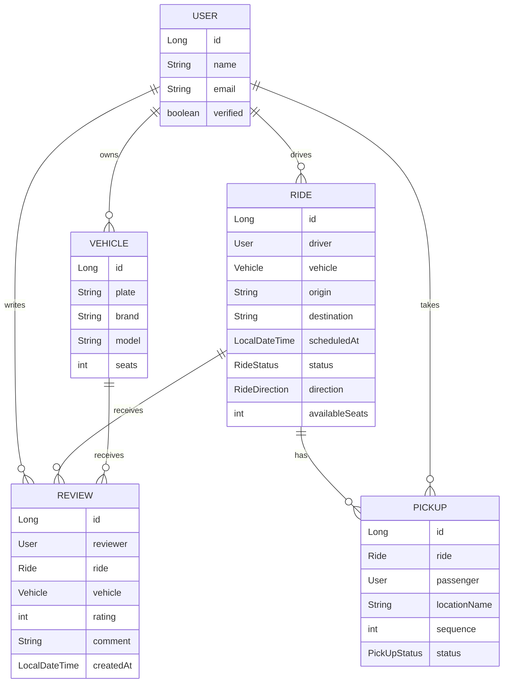

# demoCarpultec

Aplicación backend para gestionar viajes compartidos tipo carpool dentro de una comunidad universitaria. Permite administrar usuarios, vehículos, viajes, puntos de recogida, reseñas, verificación de cuentas y tracking en tiempo real.

## Stack y servicios

- Java 21
- Spring Boot 3.4.5
- Spring Web para la API REST
- Spring Data JPA con PostgreSQL
- Spring Security con JWT
- Spring WebSocket para tracking en tiempo real
- Spring Mail para notificaciones por correo
- Thymeleaf para plantillas de correo y páginas HTML
- Springdoc OpenAPI para Swagger UI
- AWS SDK v2 S3 para almacenamiento de imágenes
- Bean Validation para validaciones de entrada
- Lombok para reducir código repetitivo
- H2 y Testcontainers para pruebas

## Servicios principales

- Auth: registro, login y verificación de cuenta.
- User: gestión de perfil, imagen y datos del usuario.
- Vehicle: gestión de vehículos asociados a un propietario.
- Ride: creación, actualización, reserva de asientos y cambio de estado de los viajes.
- PickUp: manejo de puntos de recogida por viaje y pasajero.
- Review: reseñas y calificaciones sobre viajes y vehículos.
- Tracking: publicación de ubicaciones en tiempo real mediante WebSocket.
- Email: envío de correos transaccionales y plantillas HTML.

## Mensajes que envía la app

- Correo de bienvenida y verificación de cuenta.
- Correo de verificación con enlace para activar la cuenta.
- Correo de programación del viaje para el pasajero.
- Correo cuando un viaje pasa a estado activo.
- Correo cuando un viaje se completa.
- Mensajes en tiempo real de ubicación para tracking del viaje.

## Eventos

- `VerificationCodeSubmittedEvent`: se dispara cuando el usuario envía su código de verificación; el listener valida la cuenta y dispara el correo correspondiente.
- Cambios de estado del viaje: el servicio de rides notifica cuando un viaje pasa a `ACTIVE` o `COMPLETED`.
- Publicación de tracking: el controlador de tracking recibe ubicaciones y las publica por WebSocket.

## Relación entre entidades



## API y documentación

- Swagger UI: `/api/docs`
- La API expone endpoints para usuarios, vehículos, viajes, reseñas, autenticación y tracking.
- Mapas: `POST /api/maps/nearby-rides` y `@MessageMapping("/maps/nearby-rides")` sobre `/ws`, con respuesta en `/topic/maps/nearby-rides`.

## OSRM con solo .osm.pbf en Docker Compose

El compose prepara OSRM automáticamente a partir del archivo `.osm.pbf` que ya tengas en `data/`:

1. `osrm-prepare`: valida que exista el `.osm.pbf`, luego ejecuta `osrm-extract`, `osrm-partition` y `osrm-customize`.
2. `osrm`: levanta `osrm-routed` usando el dataset generado.

Variables opcionales en `.env`:

- `OSRM_MAP_NAME` (default: `peru-260523`)

Ejemplo:

```env
OSRM_MAP_NAME=peru-260523
```

Levantar servicios:

```bash
docker compose up --build
```

Nota: Los archivos grandes de mapas en `data/` quedan ignorados por Git para evitar bloqueos al hacer push.

## Si ya falló un push por archivos grandes

Si los blobs pesados quedaron en commits locales, no basta con agregarlos al `.gitignore`; hay que reescribir el historial local antes de volver a empujar.

Ejemplo rápido (mantiene tus cambios locales pero recrea commits desde `origin/main`):

```bash
git fetch origin
git reset --soft origin/main
git restore --staged data/
git add .
git commit -m "chore: setup OSRM bootstrap from PBF and ignore data artifacts"
git push origin main
```

Si el remoto no acepta por divergencia de historial, usa:

```bash
git push --force-with-lease origin main
```
